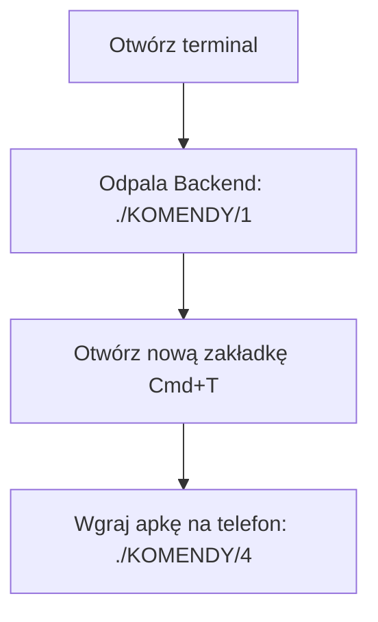

# 🎛️ PANEL DEWELOPERSKI (SKRÓTY)

Ten folder zawiera gotowe, zoptymalizowane skróty ułatwiające codzienną pracę z projektem.

---

### 📋 Szybka Ściąga (Spis Komend)

| # | Szybki skrót | Serwis / Rola | Co robi? |
| :--- | :--- | :--- | :--- |
| **`0`** | `source ./KOMENDY/0` |  | 📂 Przenosi terminal do katalogu głównego projektu |
| **`1`** | `./KOMENDY/1` |  | 🚀 Odpala bazę (proxy), migracje i 5 mikroserwisów w tle |
| **`2`** | `./KOMENDY/2` |  | 🧪 Uruchamia lokalne testy integracyjne E2E |
| **`3`** | `./KOMENDY/3` |  | 💻 Uruchamia aplikację jako natywny macOS |
| **`4`** | `./KOMENDY/4` |  | 📲 Wgrywa apkę na podłączone urządzenie (iOS/Android) |
| **`5`** | `./KOMENDY/5` |  | 🍏 Tworzy produkcyjny plik `.ipa` i otwiera Xcode |
| **`6`** | `./KOMENDY/6` |  | 🌐 Odpala stronę marketingową WWW na `localhost:3000` |

---

### 🛠️ Rekomendowane Przepływy Pracy (Workflows)

#### 🟢 Scenariusz A: Lokalna deweloperka z aplikacją mobilną
Uruchomienie lokalnego backendu oraz wgranie wersji testowej apki na telefon:



1. **Terminal 1**: Odpal backend i zostaw go aktywnego (będzie pokazywać logi na żywo):
   ```bash
   ./KOMENDY/1
   ```
2. **Terminal 2** (nowa zakładka za pomocą `Cmd + T`): Wgraj apkę na telefon:
   ```bash
   ./KOMENDY/4
   ```

#### 🔵 Scenariusz B: Weryfikacja kodu i testy integracyjne
Przetestowanie całej logiki biznesowej, bazy danych i przepływów RODO na localhost:

1. Upewnij się, że lokalny backend działa w tle (**Terminal 1**).
2. **Terminal 2** (nowa zakładka): Odpal testy E2E:
   ```bash
   ./KOMENDY/2
   ```

---

> [!TIP]
> **Szybki Powrót do Bazy**: Jeśli pracujesz głęboko w podfolderach (np. edytując pliki w `marketing-site` lub `clinical-svc`), wpisz w dowolnej chwili:
> ```bash
> source ./KOMENDY/0
> ```
> natychmiast przeniesie Cię to z powrotem do głównego folderu projektu.

> [!WARNING]
> **Brak Uprawnień (Permission Denied)**: Jeżeli system macOS zgłosi brak uprawnień do uruchomienia skryptów, nadaj je wszystkim na raz wpisując w katalogu głównym:
> ```bash
> chmod +x KOMENDY/*
> ```
