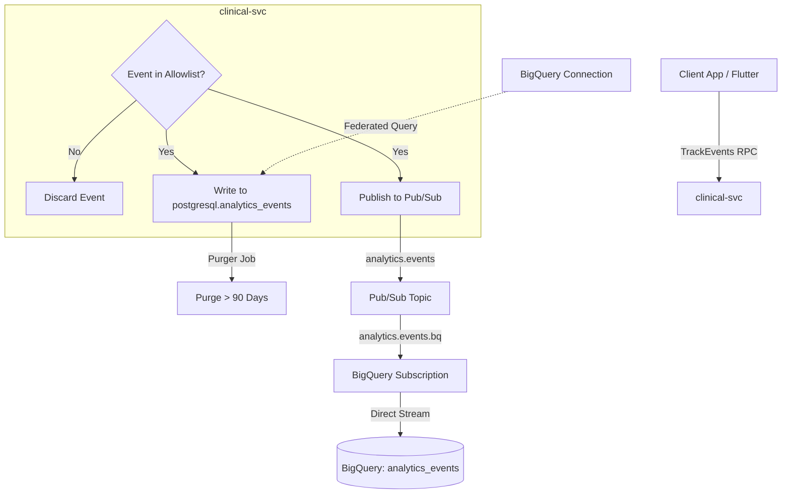

# Design: Telemetry Pipeline & Analytics Architecture

**Status:** approved & implemented.
**Replaces:** Single-database (PostgreSQL only) analytics design.

---

## 1. Problem & Goals

Initially, telemetry events (clicks, page views, recording states) were stored directly in the transaction database (PostgreSQL). While simple for early stages, this approach presented critical production risks at scale:

* **OLTP Performance Degradation (OLAP vs. OLTP):** Telemetry tables (event logs, telemetry streams) grow exponentially compared to business tables. Millions of client clicks and recording events stored in PostgreSQL would bloat backups, fragment indexes, and degrade the responsiveness of the clinical app for patients and therapists.
* **Privacy Risks (PHI Leakage):** Telemetry streams must never contain Patient Health Information (PHI) to remain compliant with GDPR and clinical confidentiality. Storing telemetry alongside clinical tables risks accidental data mixing.
* **Alerting Overhead:** Alert policies and performance monitoring in staging were previously unbound from a dedicated support channel, making warning routing difficult.

### Goals
* Limit telemetry storage in the transactional PostgreSQL database to exactly **90 days**.
* Stream all telemetry events asynchronously to **BigQuery** for permanent, cost-effective archiving and analytical queries.
* Enforce a strict **Allowlist (No-PHI Policy)** on client-side events.
* Integrate GCP Monitoring alerts with a dedicated team email channel (`kontakt@superwizor.ai`).

---

## 2. Architectural Decisions



### 2.1. Dual-Write Telemetry Pipeline
Every event received by `clinical-svc.TrackEvents` undergoes a dual-write process:
1. **PostgreSQL Event Log:** Written locally to `analytics_events`. This table serves short-term query requirements (e.g., admin dashboard filters for 7d/30d/90d ranges).
2. **GCP Pub/Sub:** Published asynchronously to the `analytics.events` topic. A direct BigQuery subscription ingestion pipeline (`analytics.events.bq`) handles streaming writes into BigQuery.

### 2.2. Strict 90-Day Postgres Purging
A background execution tool (`services/clinical-svc/cmd/purger`) periodically queries and deletes all telemetry events older than 90 days:
```sql
DELETE FROM analytics_events WHERE occurred_at < NOW() - INTERVAL '90 days';
```
This isolates PostgreSQL storage bloat and maintains high performance.

### 2.3. No-PHI Policy & Client-Event Allowlist
To comply with GDPR and ironclad clinical localization rules (P3), `clinical-svc` enforces a strict allowlist of event names. Unrecognized client events are ignored. Currently allowlisted events include:
* `app.session_started`, `screen.viewed`
* `report.read_started`, `report.read_finished`
* `recording.started`, `recording.stopped`, `recording.cancelled`
* `file_upload.picked`, `upload_pill.tapped`, `rating.tapped`
* `suggestion_banner.tapped`

### 2.4. Resilient Asynchronous Publishing
To prevent GCP Pub/Sub latency or outages from impacting therapist session workflows:
* Pub/Sub writes are executed in a non-blocking context.
* Failures in publishing telemetry do not return an error to the client app.

---

## 3. Implementation Details

### 3.1. Infrastructure Setup (Terraform / Terragrunt)
Located at [`superwizor-backend/infra/modules/analytics`](file:///Users/maciekckoklormam91/Desktop/Inne/APP%20-%20Superwizor%20AI/superwizor-backend/infra/modules/analytics):
* **BigQuery Dataset:** `analytics` located in region `europe-central2`.
* **BigQuery Table:** `analytics_events` with strict schema mappings (`event_name`, `therapist_id`, `organization_id`, `session_id`, `patient_file_id`, `report_id`, `properties` [JSON], `source`, `client_platform`, `client_version`, `occurred_at`).
* **Pub/Sub Topic:** `analytics.events`.
* **BigQuery Subscription:** `analytics.events.bq` mapped directly to the BigQuery table using GCP service account permissions (`service-PROJECT_NUMBER@gcp-sa-pubsub.iam.gserviceaccount.com` with `roles/bigquery.dataEditor`).
* **Federated Connection:** `cloud_sql_conn` allowing BigQuery to execute query joins directly against PostgreSQL tables.

### 3.2. Alerting Integration
Infrastructure alert policies configured via the monitoring module are bound to the `Email Alert Channel (kontakt@superwizor.ai)` to ensure immediate notifications on sync failures, DLQ messages, and 5xx errors.

### 3.3. Go Backend Handlers
* **Event Tracking (`analytics.go`):** The `TrackEvents` RPC handler in `clinical-svc` validates the caller's organization context, parses the client request, checks the allowlist, and handles the dual-write to PostgreSQL and Pub/Sub.
* **Purger Job (`cmd/purger`):** An independent job script connecting to PostgreSQL via SSL, executing the deletion of events beyond the 90-day retention window.

---

## 4. Verification & Testing

### 4.1. Unit Tests
* `TestTrackEvents_DualWrite` in [`analytics_test.go`](file:///Users/maciekckoklormam91/Desktop/Inne/APP%20-%20Superwizor%20AI/superwizor-backend/services/clinical-svc/internal/adapters/grpc/analytics_test.go) asserts the allowlist checks, Postgres writes, and Pub/Sub publishing behaviors.
* `TestPurger` in [`purger_db_test.go`](file:///Users/maciekckoklormam91/Desktop/Inne/APP%20-%20Superwizor%20AI/superwizor-backend/services/clinical-svc/internal/adapters/postgres/db/purger_db_test.go) validates the deletion of records older than 90 days.

### 4.2. E2E (End-to-End) Tests
All E2E patient lifecycle scenarios in [`patient_lifecycle_test.go`](file:///Users/maciekckoklormam91/Desktop/Inne/APP%20-%20Superwizor%20AI/superwizor-backend/tests/e2e/patient_lifecycle_test.go) pass successfully. Local testing requires:
1. Running `cloud-sql-proxy` on port 5433:
   ```bash
   ./cloud-sql-proxy superwizor-ai-25ecd:europe-central2:superwizor-db-bc4c27de --port=5433
   ```
2. Running local `identity-svc` (port 8080) and `clinical-svc` (port 8081).
3. Executing tests:
   ```bash
   export IDENTITY_SVC_URL="http://127.0.0.1:8080"
   export CLINICAL_SVC_URL="http://localhost:8081"
   export GCP_PROJECT_ID="superwizor-ai-25ecd"
   go test -tags=e2e -timeout=5m -v ./e2e/... -run TestPatientLifecycle
   ```
