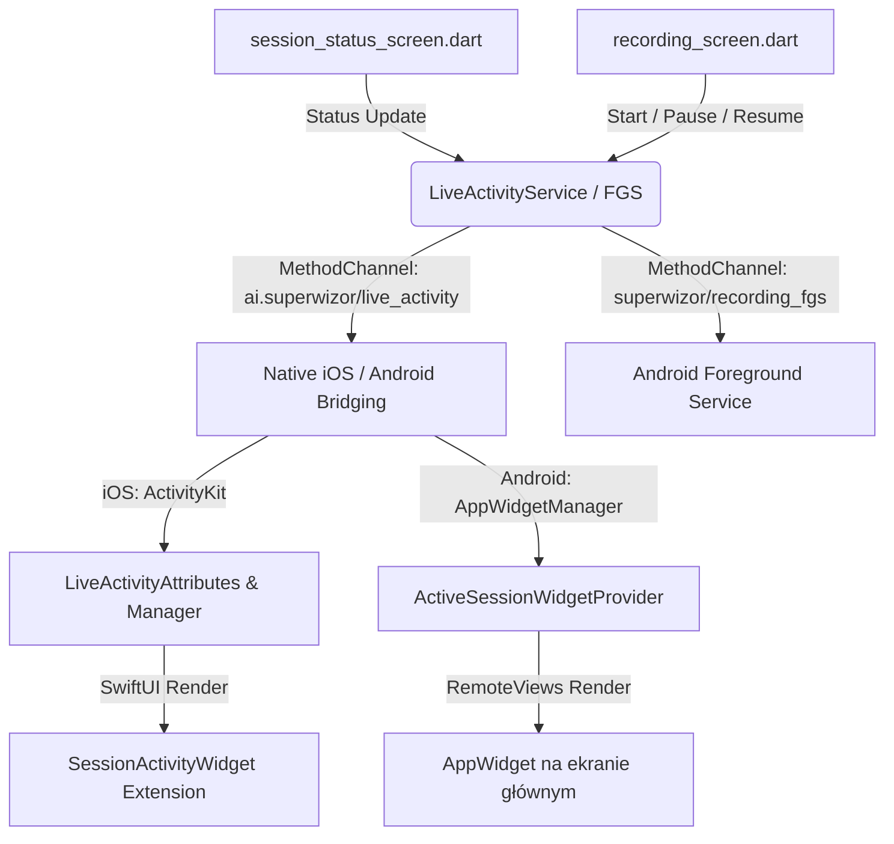

# 33. Logika Widgetów, Live Activities i Foreground Services

Dokument opisuje architekturę, przepływ danych oraz cykl życia stanów mechanizmów informowania użytkownika o statusie aktywnej sesji poza głównym widokiem aplikacji:
- **iOS Live Activity** (ekran blokady oraz Dynamic Island),
- **Android AppWidget** (widget na ekranie głównym),
- **Android Foreground Service Notification** (dynamiczne powiadomienie na pasku statusu).

---

## 1. Architektura i Przepływ Danych

System działa w architekturze hybrydowej (Flutter + kod natywny Kotlin/Swift) i komunikuje się asynchronicznie za pomocą dwukierunkowych mostków kanałowych (`MethodChannel`).



### Pliki wchodzące w skład modułu:

1. **Warstwa wspólna Dart (Flutter)**:
   - [live_activity_service.dart](file:///Users/maciekckoklormam91/Desktop/Inne/APP%20-%20Superwizor%20AI/flutter-app/superwizor/lib/services/live_activity_service.dart) – interfejs platformy do zarządzania cyklem życia widgetów (start, update, reportReady, stop, permission check).
   - [recording_foreground_service.dart](file:///Users/maciekckoklormam91/Desktop/Inne/APP%20-%20Superwizor%20AI/flutter-app/superwizor/lib/services/recording_foreground_service.dart) – interfejs do sterowania natywnym powiadomieniem w tle na Androidzie.
   - [settings_provider.dart](file:///Users/maciekckoklormam91/Desktop/Inne/APP%20-%20Superwizor%20AI/flutter-app/superwizor/lib/providers/settings_provider.dart) – zarządza flagą `liveActivitiesEnabled` w ustawieniach preferencji użytkownika.
   - [session_status_screen.dart](file:///Users/maciekckoklormam91/Desktop/Inne/APP%20-%20Superwizor%20AI/flutter-app/superwizor/lib/screens/session_status_screen.dart) i [recording_screen.dart](file:///Users/maciekckoklormam91/Desktop/Inne/APP%20-%20Superwizor%20AI/flutter-app/superwizor/lib/screens/recording_screen.dart) – główne ekrany aplikacji wywołujące aktualizacje stanu.

2. **Implementacja iOS (Swift)**:
   - [LiveActivityAttributes.swift](file:///Users/maciekckoklormam91/Desktop/Inne/APP%20-%20Superwizor%20AI/flutter-app/superwizor/ios/Runner/LiveActivityAttributes.swift) – definiuje model danych przekazywany z Darta do widgetu (w tym pola dynamiczne: `processingPhase`, `readyReportCount`, stan stopera).
   - [LiveActivityManager.swift](file:///Users/maciekckoklormam91/Desktop/Inne/APP%20-%20Superwizor%20AI/flutter-app/superwizor/ios/Runner/LiveActivityManager.swift) – obsługuje wywołania z kanału `MethodChannel`, inicjalizuje i aktualizuje natywne aktywności przez `ActivityKit`.
   - [SessionActivityWidget.swift](file:///Users/maciekckoklormam91/Desktop/Inne/APP%20-%20Superwizor%20AI/flutter-app/superwizor/ios/SessionActivityWidget/SessionActivityWidget.swift) – kod interfejsu widgetu (SwiftUI) renderujący widoki na ekranie blokady (Lock Screen) oraz w Dynamic Island (widoki: Compact, Expanded, Minimal).

3. **Implementacja Android (Kotlin)**:
   - [MainActivity.kt](file:///Users/maciekckoklormam91/Desktop/Inne/APP%20-%20Superwizor%20AI/flutter-app/superwizor/android/app/src/main/kotlin/ai/superwizor/superwizor/MainActivity.kt) – rejestracja kanałów MethodChannel dla `recording_fgs` i `live_activity` na Androidzie.
   - [ActiveSessionWidgetProvider.kt](file:///Users/maciekckoklormam91/Desktop/Inne/APP%20-%20Superwizor%20AI/flutter-app/superwizor/android/app/src/main/kotlin/ai/superwizor/superwizor/ActiveSessionWidgetProvider.kt) – implementacja AppWidget na ekranie głównym, odbierająca i rysująca stan sesji za pomocą `RemoteViews`.
   - [RecordingForegroundService.kt](file:///Users/maciekckoklormam91/Desktop/Inne/APP%20-%20Superwizor%20AI/flutter-app/superwizor/android/app/src/main/kotlin/ai/superwizor/superwizor/RecordingForegroundService.kt) – serwis mikrofonowy w tle, który utrzymuje proces aplikacji przy życiu podczas nagrywania i wyświetla dynamiczne powiadomienie (system-level notification).

---

## 2. Odwzorowanie Stanów i Przepływ UI

Aplikacja dynamicznie mapuje stan sesji na natywne komponenty według poniższej tabeli:

| Faza w Dart | Stan `LiveActivityStatus` | Prezentacja na iOS (Live Activity) | Prezentacja na Android (Widget) | Prezentacja na Android (FGS Notification) |
| :--- | :--- | :--- | :--- | :--- |
| **Nagrywanie** | `recording` | Aktywny stoper sesji, czerwona dioda z okręgami. | "Sesja w toku", ikona nagrywania. | "Trwa nagrywanie sesji" |
| **Pauza** | `paused` | Zatrzymany stoper, żółta dioda `#FCAE2F`, ikona pauzy. | "Pauza", ikona wstrzymania. | "Trwa nagrywanie sesji" (brak zmian) |
| **Wgrywanie** | `uploading` | "Wgrywanie nagrania...", kręcące się niebieskie kółko. | "Wgrywanie nagrania..." | "Wgrywanie nagrania..." |
| **Analiza AI** | `analyzing` | "Analizowanie sesji...", kręcące się fioletowe kółko. | "Analizowanie sesji..." | "Analizowanie sesji..." |
| **Raport Gotowy** | `reportReady` | Zielony ptaszek, złoty button `#FCAE2F` "Pokaż raport". | "Nowy raport czeka w kartotece" | Serwis i powiadomienie są automatycznie niszczone. |

### Obsługa Wielu Raportów (`reportCount > 1`):
Jeśli użytkownik ma więcej niż jeden nieprzeczytany raport w tle, widok na iOS automatycznie zmienia się w tryb zbiorczy:
- Tekst zmienia się na: *"Twoje raporty"* z liczbą gotowych raportów w złotym kółku.
- Przycisk zmienia się na: *"Otwórz kartotekę"*, a kliknięcie przenosi użytkownika do głównego ekranu z listą klientów/sesji.

---

## 3. Zarządzanie Zgodami i Uprawnieniami

System weryfikuje status zezwoleń systemowych, aby zapewnić płynną ścieżkę użytkownika (User Journey).

1. **iOS Permission Flow**:
   - iOS pozwala na globalne lub jednostkowe wyłączenie Aktywności na żywo w ustawieniach systemu (*Ustawienia → Superwizor → Aktywności na żywo*).
   - Metoda `isSystemEnabled()` w [LiveActivityService](file:///Users/maciekckoklormam91/Desktop/Inne/APP%20-%20Superwizor%20AI/flutter-app/superwizor/lib/services/live_activity_service.dart) odpytuje natywną klasę `ActivityAuthorizationInfo().areActivitiesEnabled` poprzez kanał `checkPermission`.
   - Przy próbie włączenia podglądu (w [menu_screen.dart](file:///Users/maciekckoklormam91/Desktop/Inne/APP%20-%20Superwizor%20AI/flutter-app/superwizor/lib/screens/menu_screen.dart) lub z poziomu karty instruktażowej w [recording_screen.dart](file:///Users/maciekckoklormam91/Desktop/Inne/APP%20-%20Superwizor%20AI/flutter-app/superwizor/lib/screens/recording_screen.dart)), jeśli system wykryje brak uprawnień, wyświetlany jest elegancki, natywny `EuphireActionSheet`:
     - Tytuł: *"Wymagana zgoda systemowa"*
     - Przycisk akcji: *"Otwórz ustawienia"* – wywołuje `openSystemSettings()`, co bezpośrednio przekierowuje użytkownika do ustawień aplikacji w systemie iOS (`UIApplication.openSettingsURLString`).
     - Przycisk rezygnacji: *"Anuluj"* – zamyka okno bez modyfikacji preferencji lokalnych.

2. **Android AppWidget Permission**:
   - Android nie posiada analogicznego systemowego przełącznika zezwoleń dla pulpitowych widgetów – użytkownik sam decyduje, czy doda widget na pulpit.
   - Metoda `isSystemEnabled()` na Androidzie zawsze zwraca `true`.

---

## 4. Wytyczne Dotyczące Designu (Aesthetics)

Podczas prac nad wyglądem widgetów należy ściśle przestrzegać założeń premium UX:
- **Kolory**: 
  - Żółte/złote akcenty (pauza, przyciski akcji, wskaźniki gotowości) powinny używać dokładnie koloru `#FCAE2F` (a nie agresywnej czerwieni czy systemowego pomarańczu).
  - Zielony dla sukcesu / gotowego raportu.
  - Niebieski i fioletowy dla procesów asynchronicznych (przesyłanie i analiza), dających odczucie dynamicznej, ciężkiej pracy AI w tle.
- **Glassmorphism**: Tło na ekranie blokady iOS powinno używać delikatnego rozmycia systemowego oraz gradientu podkreślającego głębię.
- **Micro-interactions**: Zamiast skomplikowanych animacji (które na ekranie blokady iOS są ograniczone przez system i wymagają `TimelineView`), używamy statycznych, nakładających się okręgów o różnym stopniu przezroczystości, symulujących fale dźwiękowe.
- **Teksty (UX Writing)**:
  - Język powinien być naturalny, przyjazny i pozbawiony żargonu technicznego (unikamy zwrotów typu *"Dynamic Island"* czy *"Live Activity"*, piszemy o *"podglądzie na ekranie blokady"*).
  - Eliminujemy długie myślniki (`—`), które w języku polskim mogą kojarzyć się z surowym wyjściem LLM.

---

## 5. Rozwijanie i Testowanie Modułu

### Jak dodać nowy status sesji?
1. Zaktualizuj enum `LiveActivityStatus` w [live_activity_service.dart](file:///Users/maciekckoklormam91/Desktop/Inne/APP%20-%20Superwizor%20AI/flutter-app/superwizor/lib/services/live_activity_service.dart).
2. Obsłuż nową wartość w `MainActivity.kt` (przypisanie tekstu statusu w `ActiveSessionWidgetProvider.statusText`).
3. Zaktualizuj logikę mapowania statusu w `LiveActivityManager.swift` (mapowanie na pole `processingPhase`).
4. Dodaj nową gałąź renderowania lub ikonę w SwiftUI w pliku [SessionActivityWidget.swift](file:///Users/maciekckoklormam91/Desktop/Inne/APP%20-%20Superwizor%20AI/flutter-app/superwizor/ios/SessionActivityWidget/SessionActivityWidget.swift).
5. Dodaj odpowiedni przypadek testowy w [live_activity_service_test.dart](file:///Users/maciekckoklormam91/Desktop/Inne/APP%20-%20Superwizor%20AI/flutter-app/superwizor/test/services/live_activity_service_test.dart).

### Uruchamianie Testów Jednostkowych:
Aby zweryfikować poprawność działania MethodChannel dla obu platform w Dart, uruchom:
```bash
# Testy integracji i wywołań Live Activities / AppWidget
flutter test test/services/live_activity_service_test.dart

# Testy powiadomień w tle na Androidzie (Foreground Service)
flutter test test/services/recording_foreground_service_test.dart
```

Dzięki tym testom upewniamy się, że modyfikacje kodu w aplikacji nie przerwą integracji ani nie zmienią formatu danych przesyłanych do systemów natywnych.

---

## 6. Lekcje i Gotchas z Sesji Debugowania (czerwiec 2026)

### 6.1 Dynamic Island — Ograniczenia Hardware'owe

Compact view DI składa się z trzech stref:
- **`compactLeading`** (~36pt) — po lewej stronie aparatu
- **Aparat/Face ID** — fizyczne otwory, **nie da się tam nic renderować**
- **`compactTrailing`** (~36pt) — po prawej stronie aparatu

Każda apka (Uber, Spotify, Apple Music) ma tę samą pustą przestrzeń w środku. Pomarańczowa kropka w centrum to **systemowy wskaźnik mikrofonu iOS** — nie nasza.

**Rozwiązanie**: zamiast samej ikony, pokazujemy kontekstowy tekst:
- Nagrywanie: `🔴 Sesja` (ember dot + bold "Sesja")
- Pauza: `🟡 Pauza` (gold dot + bold "Pauza")
- Content jest owinięty w `Group { }.frame(maxHeight: .infinity, alignment: .center)` dla wyśrodkowania pionowego

### 6.2 Lock Screen Widget — Border Clipping

iOS przycina widgety na Lock Screenie po zaokrąglonych rogach. Jeśli border jest nałożony jako `overlay`, rogi są obcięte i niewidoczne.

**Rozwiązanie**: użyć `ZStack` z wewnętrznym `padding(3)` i `RoundedRectangle.strokeBorder` zamiast `overlay`. Dzięki temu border jest wewnątrz strefy clipu.

### 6.3 Mid-Session Toggle (Włączanie/Wyłączanie w Trakcie Nagrywania)

Użytkownik może przejść do Ustawień → wyłączyć widgety → wrócić do nagrywania.

**Problem**: `settingsNotifier.toggleLiveActivities(v)` aktualizuje tylko `SharedPreferences`. Natywna Live Activity nie jest zatrzymywana.

**Rozwiązanie**: w [menu_screen.dart](file:///Users/maciekckoklormam91/Desktop/Inne/APP%20-%20Superwizor%20AI/flutter-app/superwizor/lib/screens/menu_screen.dart) toggle handler bezpośrednio wywołuje `la.stop()` przy wyłączeniu:
```dart
settingsNotifier.toggleLiveActivities(v);
if (!v) {
  final la = ref.read(liveActivityServiceProvider);
  la.stop();
}
```

> [!WARNING]
> **Znany edge case**: wyłączenie widgetów mid-session nie zawsze natychmiast zamyka DI na iOS 26 beta. System może trzymać LA jeszcze kilka sekund. To jest ograniczenie iOS, nie bug w naszym kodzie.

### 6.4 iOS 26 Beta — Znane Problemy

| Problem | Opis | Status |
|---------|------|--------|
| `SIGKILL` w tle | iOS 26 agresywnie zabija proces apki w tle, nawet podczas nagrywania | Wymaga mechanizmu orphan recovery |
| Xcode debug timeout | `flutter run` regularnie nie może podłączyć debuggera | Obejście: `flutter install` + ręczne uruchomienie |
| Instalacja się zacina | `flutter run --profile` wisi na "Installing and launching..." | Obejście: `flutter install -d <device>` |
| Siri Apple Intelligence opt-out | Bez `INSiriIntent` opt-out w `Info.plist`, iOS 26 może indeksować treści sesji | Dodano `INSendMessageIntentDonationMetadata` opt-out |

### 6.5 Deploy Best Practice na iOS 26

```bash
# Zamiast flutter run (często timeout na debuggerze):
flutter install -d <DEVICE_ID> --profile

# Jeśli instalacja się zacina:
killall Xcode
flutter clean
flutter pub get
flutter install -d <DEVICE_ID> --profile

# Użytkownik musi ręcznie uruchomić apkę po flutter install
```
### 6.6 Rozjazd Ustawień: Apka vs iOS System (Nierozwiązany)

> [!CAUTION]
> **To jest znany, nierozwiązany problem. Synchronizacja 1:1 między ustawieniami apki a ustawieniami iOS jest technicznie niemożliwa z obecnym API Apple.**

**Scenariusze rozjazdu:**

| Scenariusz | Apka mówi | iOS mówi | Efekt |
|------------|-----------|----------|-------|
| User włącza w apce, ale iOS blokuje | ✅ Włączony | ❌ Wyłączony | LA się nie odpali, bo `ActivityAuthorizationInfo.areActivitiesEnabled == false` |
| User wyłącza w iOS po włączeniu w apce | ✅ Włączony | ❌ Wyłączony | LA przestanie działać, apka nie wie o zmianie |
| User klika "Anuluj" na permission sheecie | ✅ Włączony (toggle nie zmienił się) | ❌ Wyłączony | Rozjazd — toggle w apce sugeruje że działa, ale iOS blokuje |
| User włącza w iOS po wyłączeniu w apce | ❌ Wyłączony | ✅ Włączony | LA nie startuje, bo apka nie próbuje |

**Dlaczego nie da się tego zsynchronizować:**
- iOS **nie wysyła notyfikacji** do apki kiedy użytkownik zmienia ustawienia LA w Ustawieniach systemowych
- `ActivityAuthorizationInfo.areActivitiesEnabled` można odpytać tylko **punktowo** (np. przy próbie włączenia)
- Nie ma callbacka/observera na zmianę tego stanu w tle
- Jedyny workaround to polling (np. `Timer.periodic` co 5s) — ale to jest anty-pattern i zużywa baterię

**Obecne podejście (pragmatyczne):**
1. Przy **włączaniu** w apce → sprawdzamy `isSystemEnabled()` → jeśli iOS blokuje, pokazujemy sheet z linkiem do ustawień iOS → **nie zmieniamy toggle**
2. Przy **wyłączaniu** w apce → bezpośrednio `la.stop()` → działa niezawodnie
3. Nie próbujemy synchronizować w drugą stronę (iOS → apka)

**Potencjalne przyszłe rozwiązania:**
- [ ] Sprawdzać `isSystemEnabled()` przy każdym `didChangeAppLifecycleState(.resumed)` i wyłączać toggle jeśli iOS zablokował
- [ ] Dodać `ActivityAuthorizationInfo().activityEnablementUpdates` (async stream dostępny od iOS 17.2) — **ale wymaga testów na iOS 26**
- [ ] Zaakceptować rozjazd jako "known limitation" i nie walczyć z tym

### 6.7 Live Activity & FCM Background Pushes (Lipiec 2026 - Faza 4)

Podczas integracji powiadomień FCM z Live Activities napotkano krytyczne błędy architektoniczne, które wymusiły uproszczenie logiki zamykania widgetów:

1. **MethodChannel w Background Isolate**: Dart background FCM handler (`_firebaseMessagingBackgroundHandler`) działa w odizolowanym headless `FlutterEngine`, na którym nie są zarejestrowane kanały MethodChannel głównej aplikacji. Wywołania MethodChannel z tła rzucają ciche wyjątki `MissingPluginException`. 
   * **Rozwiązanie**: Przechwytywanie powiadomień FCM dla Live Activities natywnie po stronie iOS w `AppDelegate.swift` (`application(_:didReceiveRemoteNotification:)`) i wywoływanie `LiveActivityManager` bezpośrednio z pominięciem Darta.

2. **Zacinający się Widget (Hanging Widget) i Zgubiony Dźwięk Sukcesu**: 
   * Opieranie zamykania widgetu wyłącznie na natywnym stanie (odpytywanie `isReportReady` przez `shouldDismissOnResume`) okazało się zawodne. Jeśli powiadomienie FCM "zginęło" w sieci, widget natywny zostawał w stanie "analizowanie". Po wznowieniu aplikacji (warm start), aplikacja nie potrafiła go zamknąć, ponieważ natywny stan twierdził, że sesja nadal trwa.
   * Równocześnie, jeśli użytkownik powrócił do aplikacji i odświeżył listę (pull-to-refresh), stan widgetów ulegał zniszczeniu, co gubiło informację o poprzednim statusie i uniemożliwiało odtworzenie dźwięku sukcesu na ekranie głównym. Jeśli użytkownik zamknął `SessionStatusScreen` zanim stoper kaskady sukcesu dobił do końca, wyjątki związane z przerwaniem animacji powodowały trwałe zawieszenie widgetu.
   * **Rozwiązanie (Obecna Architektura)**: Logika zamykania widgetów została drastycznie uproszczona w oparciu o absolutny stan aplikacji w Dart:
     * **Global Cleanup w HomeScreen**: Przy każdym zbudowaniu ekranu kartoteki sprawdzamy, czy w całej aplikacji istnieje *jakakolwiek* sesja w fazie nagrywania, wgrywania lub analizy. Jeśli nie – `LiveActivityService.stopFromBackground()` jest wywoływane w ciemno, gwarantując sprzątnięcie starych/zawieszonych widgetów.
     * **Defensywny Dispose**: W `SessionStatusScreen` upewniono się, że zamknięcie ekranu (`dispose`) w stanie `done` bezwzględnie zamyka widget (nawet jeśli kaskada animacji/dźwięków została przerwana przez niecierpliwego użytkownika).
     * **Statyczny Stan Sukcesu**: Flaga poprzedniego statusu (`_prevStatuses`) w `HomeScreen` została podniesiona do zmiennej statycznej, aby przetrwać niszczenie obiektu `State` podczas pull-to-refresh, dzięki czemu dźwięk sukcesu zawsze zostanie odtworzony po powrocie do aplikacji.

3. **Brak Głębokiego Linkowania (Deep Linking) i Wznawianie w Menu**:
   * **Problem**: Kliknięcie głównego obszaru powiadomienia Live Activity na zablokowanym ekranie zazwyczaj tylko "wznawiało" aplikację bez kontekstu, lądując na `HomeScreen` lub w ustawieniach, jeśli tam została zamrożona. Widget zostawał zawieszony bez wywołania ekranu sukcesu.
   * **Rozwiązanie**: Dodano modyfikator `.widgetURL` do głównego widoku `LockScreenView` w `SessionActivityWidget.swift`. Teraz kliknięcie *dowolnego* miejsca w banerze przekazuje systemowi URL `superwizor://report/ID`, który Flutter przechwytuje przez `onGenerateRoute` (lub z pomocą pakietu app_links) i płynnie przenosi bezpośrednio na `SessionStatusScreen`.

4. **Kaskada Sukcesu w Tle (Auto-Routing wewnątrz aplikacji)**:
   * **Problem**: Jeśli użytkownik nawigował po aplikacji (np. po menu Ustawień) i przetwarzanie AI dobiegło końca, aplikacja odbierała push FCM w pierwszym planie, ale użytkownik musiał ręcznie wrócić do sesji, żeby zobaczyć powiadomienie.
   * **Rozwiązanie**: W `main.dart` w handlerze `FirebaseMessaging.onMessage.listen` dodano logikę automatycznego wypychania trasy `pushNamed('/session', arguments: sessionId)`, pod warunkiem, że użytkownik nie jest już na tym ekranie. Przenosi to użytkownika automatycznie na kaskadę sukcesu. Aby uniknąć duplikowania tras przy wielokrotnych odświeżeniach, `SessionStatusScreen` rejestruje `currentlyViewedSessionId` jako flagę globalną.

---
*Dokumentacja stworzona w czerwcu 2026 r. w ramach wdrożenia stabilizacji widgetów i Dynamic Island. Zaktualizowana 19 lipca 2026 r. o lekcje z sesji integracji FCM i uproszczenia architektury czyszczenia (Faza 4).*
