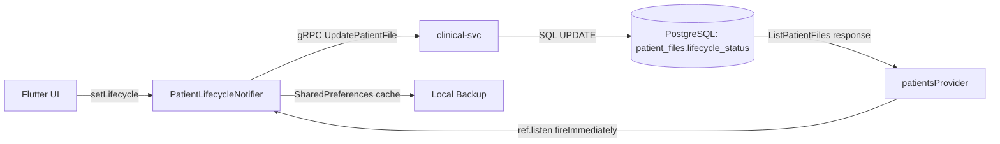

# 34. Statusy Kartotek Pacjentów i Schemat Bazy Danych PostgreSQL

Dokument opisuje:
1. System cyklu życia kartotek pacjentów (ACTIVE/COMPLETED/PAUSED)
2. Znane bugi i otwarte problemy
3. Przegląd schematu bazy danych PostgreSQL (Cloud SQL)

---

## 1. Cykl Życia Kartoteki Pacjenta (Patient Lifecycle)

### Architektura



### Stany

| Stan | Wartość DB | Opis | Kolor w UI |
|------|-----------|------|------------|
| **Aktywna** | `ACTIVE` | Domyślny — terapeuta prowadzi pacjenta | Brak wyróżnienia |
| **Zakończona** | `COMPLETED` | Terapia zamknięta | Szary |
| **Wstrzymana** | `PAUSED` | Tymczasowa przerwa | Żółty |

### Pliki

- [patient_lifecycle_provider.dart](file:///Users/maciekckoklormam91/Desktop/Inne/APP%20-%20Superwizor%20AI/flutter-app/superwizor/lib/providers/patient_lifecycle_provider.dart) — Riverpod Notifier zarządzający mapą `{patientId: PatientLifecycle}`
- [patient_provider.dart](file:///Users/maciekckoklormam91/Desktop/Inne/APP%20-%20Superwizor%20AI/flutter-app/superwizor/lib/providers/patient_provider.dart) — pobiera pacjentów z backendu (gRPC → Patient model z `lifecycleStatus`)
- [sort_filter_provider.dart](file:///Users/maciekckoklormam91/Desktop/Inne/APP%20-%20Superwizor%20AI/flutter-app/superwizor/lib/providers/sort_filter_provider.dart) — grupowanie/filtrowanie na liście kartotek

### Przepływ danych

1. **Write path**: UI → `setLifecycle()` → optimistic update + gRPC `UpdatePatientFile(lifecycleStatus: "COMPLETED")` → backend SQL UPDATE
2. **Read path**: `patientsProvider` ładuje `Patient` z `lifecycleStatus` z backendu → `ref.listen(patientsProvider, fireImmediately: true)` synchronizuje mapę lifecycle

### Migracja DB: `000058_patient_file_lifecycle`

```sql
ALTER TABLE patient_files
  ADD COLUMN lifecycle_status TEXT NOT NULL DEFAULT 'ACTIVE';

UPDATE patient_files
  SET lifecycle_status = 'COMPLETED'
  WHERE is_process_closed = true;

ALTER TABLE patient_files
  ADD CONSTRAINT chk_lifecycle_status
  CHECK (lifecycle_status IN ('ACTIVE', 'COMPLETED', 'PAUSED'));
```

Backfill: istniejące kartoteki z `is_process_closed=true` automatycznie dostają `lifecycle_status='COMPLETED'`.

---

## 2. Znane Bugi i Otwarte Problemy

### 🔴 BUG: Statusy nie odświeżają się po reinstall apki

**Symptom**: Po wgraniu nowego builda (lub reinstall z App Store), kartoteki wyświetlają się bez grupowania na zakończone/wstrzymane. Dopiero po wylogowaniu i ponownym zalogowaniu statusy wracają.

**Root cause** (zdiagnozowany 19.06.2026):
- `PatientLifecycleNotifier.build()` zwraca pusty `{}` i asynchronicznie:
  1. `_loadFromPrefs()` — po reinstall SharedPreferences jest **puste** → nic nie zwraca
  2. `_syncFromPatientsProvider()` — `patientsProvider` jest jeszcze w stanie `loading` → nic nie zwraca
  3. `ref.listen(patientsProvider)` — **bez `fireImmediately: true`** nie łapie pierwszego załadowania danych

**Fix zastosowany**: dodano `fireImmediately: true` do `ref.listen` w `build()`:
```dart
ref.listen<AsyncValue<List<Patient>>>(patientsProvider, (_, next) {
  next.whenData((patients) {
    // sync lifecycle map from backend data
  });
}, fireImmediately: true);  // ← FIX
```

**Status**: Fix wdrożony, ale **nie w pełni zweryfikowany**. Wymaga testów w scenariuszach:
- [ ] Fresh install (nowy użytkownik) → czy statusy ładują się od razu?
- [ ] Re-install (`flutter install`) → czy statusy widoczne bez re-loginu?
- [ ] Przełączenie konta (logout → login innego terapeuty) → czy statusy się aktualizują?
- [ ] Offline start (brak sieci) → czy SharedPreferences cache działa?

### 🟡 UWAGA: Hive Cache vs SharedPreferences

`PatientsNotifier` używa **Hive** jako cache:
- **Fresh cache** (< TTL): zwraca od razu bez sieci
- **Stale cache**: zwraca stare dane + `_backgroundRefresh()` w tle
- **Cold cache** (reinstall): blokuje na sieć

`PatientLifecycleNotifier` używa **SharedPreferences** jako backup.

Po reinstall **oba** cache'y są puste → pełna zależność od backendu.

---

## 3. Schemat Bazy Danych PostgreSQL (Cloud SQL)

### Połączenie

| Parametr | Wartość |
|----------|---------|
| Instancja | `superwizor-db-bc4c27de` |
| Region | `europe-central2` |
| Baza | `superwizor` |
| Użytkownik | `superwizor_app` |
| DSN Secret | `postgres-database-url` (Secret Manager) |

### Tabele — Przegląd

Na dzień 19.06.2026 mamy **59 migracji** tworzące następujące tabele:

#### Rdzeń (Identity & Clinical)
| Tabela | Migracja | Opis |
|--------|----------|------|
| `addresses` | 000003 | Adresy organizacji |
| `organizations` | 000003 | Organizacje/gabinety |
| `users` | 000003 | Terapeuci (Firebase Auth UID) |
| `modalities` | 000005 | Modalności terapeutyczne (CBT, psychodynamiczna, itd.) |
| `therapist_patient_relations` | 000005 | Relacja terapeuta↔pacjent |
| `patient_files` | 000005 | **Kartoteki pacjentów** — centralna tabela kliniczna |
| `audit_events` | 000005 | Logi audytowe |

#### Pipeline Sesji (Ingestion & AI)
| Tabela | Migracja | Opis |
|--------|----------|------|
| `audio_uploads` | 000007 | Metadane wgranych plików audio |
| `audio_chunks` | 000023 | Chunki audio do streamingu STT |
| `sessions` | 000007 | **Sesje terapeutyczne** |
| `transcripts` | 000007 | Transkrypcje (envelope-encrypted, ADR-IMPL-006) |
| `transcript_segments` | 000007 | Segmenty transkrypcji (derived) |
| `reports` | 000007 | **Raporty AI** generowane przez LLM |
| `hitop_dimensions` | 000007 | Wymiary HiTOP (konfiguracja) |
| `hitop_measurements` | 000007 | Pomiary HiTOP per sesja |
| `rag_memories` | 000007 | Pamięć RAG — kontekst z poprzednich sesji |
| `stt_operations` | 000021 | Operacje STT (Chirp 3) |

#### Billing & Subscriptions
| Tabela | Migracja | Opis |
|--------|----------|------|
| `subscription_plans` | 000028 | Plany subskrypcyjne |
| `subscriptions` | 000028 | Aktywne subskrypcje użytkowników |
| `usage_counters` | 000028 | Liczniki użycia (sesje/miesiąc) |
| `pending_reservations` | 000028 | Rezerwacje sesji (pre-billing) |
| `usage_events` | 000028 | Zdarzenia użycia |
| `payment_events` | 000028 | Zdarzenia płatności (Stripe webhooks) |
| `invoices` | 000057 | Faktury |
| `platform_fixed_costs` | 000047 | Koszty stałe platformy |

#### Powiadomienia & Komunikacja
| Tabela | Migracja | Opis |
|--------|----------|------|
| `fcm_tokens` | 000009 | Tokeny FCM do push notifications |
| `notification_deliveries` | 000009 | Log dostarczeń powiadomień |
| `email_templates` | 000041 | Szablony emaili |
| `email_drip_log` | 000050 | Log kampanii drip |

#### CRM & Admin
| Tabela | Migracja | Opis |
|--------|----------|------|
| `crm_notes` | 000051 | Notatki CRM |
| `crm_follow_ups` | 000051 | Follow-upy CRM |
| `crm_tags` | 000051 | Tagi CRM |
| `crm_excluded_users` | 000051 | Wykluczeni użytkownicy CRM |
| `crm_email_log` | 000054 | Log emaili CRM |

#### Inne
| Tabela | Migracja | Opis |
|--------|----------|------|
| `invitations` | 000035 | Zaproszenia do platformy |
| `patient_notes` | 000040 | Notatki terapeuty o pacjencie |
| `consent_records` | 000046 | Rekordy zgód (GDPR) |
| `outbox_events` | 000031 | Outbox pattern — eventy do Pub/Sub |
| `report_ratings` | 000015 | Oceny raportów AI |
| `preference_suggestions_log` | 000015 | Log sugestii preferencji raportu |
| `modality_prompt_versions` | 000052 | Wersje promptów per modalność |
| `analytics_events` | 000044 | Zdarzenia analityczne |

### Szyfrowanie (ADR-DM-002)

Kolumny PHI (Protected Health Information) są **envelope-encrypted**:
- `*_ciphertext` — zaszyfrowane dane
- `*_encrypted_dek` — klucz DEK zaszyfrowany kluczem KEK z Cloud KMS
- KEK: `superwizor-keyring/app-data-key`
- Implementacja: `pkg/cryptobox`

### Kluczowe Constraints

```
patient_files.lifecycle_status IN ('ACTIVE', 'COMPLETED', 'PAUSED')
sessions.status IN ('RECORDING', 'UPLOADING', 'TRANSCRIBING', 'ANALYZING', 'COMPLETED', 'FAILED')
```

---

## 4. Kolejne Kroki (Backlog)

- [ ] **Weryfikacja fireImmediately fix** — przetestować na czystym urządzeniu
- [ ] **Orphan session recovery** — po SIGKILL na iOS 26, sesja nagrywania jest "osieroconá" → manifest na dysku + recovery dialog przy ponownym uruchomieniu
- [ ] **Sync audit** — sprawdzić czy wszystkie pola z `patient_files` (w tym nowe z migracji 000059: `session_viewed`, `avatar_config`) dochodzą do Flutter
- [ ] **Cache invalidation strategy** — kiedy Hive cache powinien być traktowany jako stale? Obecny TTL nie jest jasny

---
*Dokument stworzony 19 czerwca 2026 r.*
