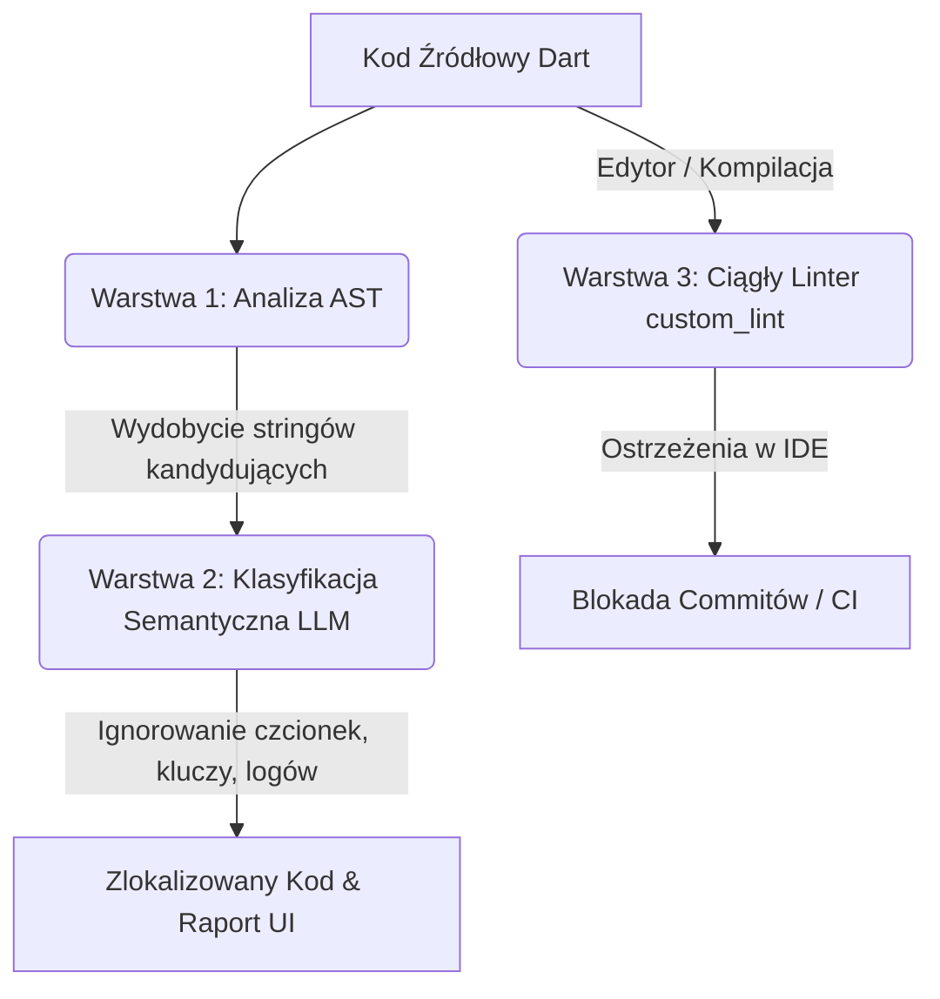

# 36. Automatyzacja Audytu Lokalizacji i Zapobieganie Hardkodowaniu

Niniejszy dokument opisuje metodyki, narzędzia oraz dobre praktyki wypracowane w celu automatycznego wykrywania, klasyfikacji i eliminowania zahardkodowanych tekstów interfejsu użytkownika (UI) w aplikacji Flutter (Superwizor AI). Dokument orientuje również przyszłe agenty kodujące (LLM) w zakresie bezbłędnej lokalizacji kodu.

---

## 1. Architektura Wielopoziomowego Audytu

Aby zapewnić 100% pewności, że w aplikacji nie ma zahardkodowanych polskich lub angielskich tekstów widocznych dla terapeuty, stosujemy trójwarstwową weryfikację:



### Warstwa 1: Analiza AST (Abstract Syntax Tree)
Wyszukiwanie tekstów za pomocą wyrażeń regularnych (RegEx) w dużych projektach jest wysoce zawodne (ze względu na stringi wieloliniowe, interpolacje, komentarze). Rozwiązaniem jest parser AST wbudowany w kompilator Dart (`package:analyzer`).
* **Zaleta**: Analizuje drzewo składniowe kodu Dart. Pozwala precyzyjnie zidentyfikować węzły typu `SimpleStringLiteral` oraz `StringInterpolation`.
* **Heurystyka kontekstowa**: Analizuje rodziców węzła (`node.parent`), co pozwala automatycznie pomijać:
  * Dyrektywy importu (`import`, `export`, `part`).
  * Adnotacje (np. `@override`).
  * Klucze map (np. `json['key']`).
  * Logi deweloperskie i wyjątki (np. wywołania `print`, `debugPrint`, `log`, rzucanie klas `Exception`, `Error`, instancje `RegExp`, `MethodChannel`).

### Warstwa 2: Semantyczna Klasyfikacja (LLM)
AST wyodrębnia surowe kandydaty na stringi. Wiele z nich to stałe techniczne (np. nazwy czcionek `'Montserrat'`, typy MIME `'audio/flac'`, kody formatowania dat `'HH:mm'`). 
* **Zaleta**: Klasyfikator LLM analizuje kontekst semantyczny i dzieli stringi na:
  * `UI_TEXT`: Tekst widoczny dla użytkownika końcowego wymagający lokalizacji w plikach `.arb`.
  * `TECHNICAL`: Znaki techniczne, klucze, fonty, stałe, które muszą pozostać w kodzie.

### Warstwa 3: Ciągły Linter w IDE (`custom_lint`)
Aby zapobiec ponownemu wprowadzaniu zahardkodowanych stringów przez deweloperów, wdrożono paczkę `hardcoded_strings_lint` w oparciu o framework `custom_lint`.
* **Zaleta**: Linter działa w czasie rzeczywistym w VS Code/Xcode oraz podczas kompilacji (`flutter analyze`), zgłaszając ostrzeżenie `avoid_hardcoded_strings_in_widgets` przy próbie wpisania surowego stringa wewnątrz widgetu.

---

## 2. Lekcje z Implementacji Skryptów i Subprocesów

W trakcie budowania skryptów integrujących Pythona z narzędziami Dart wyciągnięto następujące wnioski:

### Obsługa Szumów ze Strumienia `stdout` w Dart
Uruchomienie skryptów Dart za pomocą subprocesu w Pythonie (`subprocess.run(["dart", "run", ...])`) często zwraca dodatkowe komunikaty kompilatora (np. `Building package...`, `Running build hooks...`) na strumieniu `stdout`.
* **Problem**: Próba bezpośredniego parsowania całego strumienia jako JSON przez `json.loads()` kończy się błędem `ValueError: Expecting value: line 1 column 1`.
* **Dobra Praktyka (Python)**: Należy wyodrębnić wyłącznie fragment pasujący do struktury tablicy JSON (od pierwszego `[` do ostatniego `]`):
  ```python
  stdout_str = res.stdout.strip()
  start = stdout_str.find('[')
  end = stdout_str.rfind(']')
  if start != -1 and end != -1:
      json_data = json.loads(stdout_str[start:end+1])
  ```

---

## 3. Projekt: Automatyczna Pętla Weryfikacji Ekranów (Screen-by-Screen LLM Loop)

Zamiast ręcznie czuwać przed klawiaturą, można wdrożyć w pełni zautomatyzowany skrypt walidacyjny, który wykonuje weryfikację deterministycznie w pętli dla każdego ekranu/pliku.

### Algorytm Działania Skryptu Weryfikującego
1. **Skanowanie katalogów**: Python wyszukuje wszystkie pliki w katalogach `lib/screens/` oraz `lib/widgets/`.
2. **Wyodrębnienie AST**: Dla każdego pliku uruchamiany jest parser AST, aby pobrać wyłącznie stringi z tego konkretnego pliku.
3. **Iteracyjna weryfikacja LLM**: Dla każdego pliku skrypt wysyła zapytanie do LLM (Gemini 2.5 Flash / API Vertex AI) z pełnym kodem pliku oraz listą znalezionych stringów.
4. **Pytanie do LLM**:
   > „Oto kod pliku `X.dart` oraz lista wyekstrahowanych z niego stringów: `[S1, S2, ...]`. Przeanalizuj kod i wskaż, które z tych stringów są prezentowane użytkownikowi (UI) w języku polskim lub angielskim bez użycia `AppLocalizations`. Zwróć wynik jako JSON.”
5. **Generowanie raportu**: Skrypt zbiera odpowiedzi i tworzy skumulowany raport błędów lokalizacji.

### Przykładowy Skrypt Weryfikujący (`scratch/llm_audit_loop.py`)
Skrypt ten można uruchomić lokalnie, a on sam wywoła komendy analizy i sprawdzi każdy plik:

```python
import os
import json
import subprocess

def run_audit_loop():
    # 1. Pobierz surowe dane z AST parsera
    print("Pobieranie surowych kandydatów z AST...")
    project_root = "flutter-app/superwizor"
    dart_script = os.path.join(project_root, "lib", "scratch", "find_hardcoded_ast.dart")
    
    res = subprocess.run(["dart", "run", dart_script], capture_output=True, text=True, cwd=project_root)
    stdout_str = res.stdout.strip()
    
    start = stdout_str.find('[')
    end = stdout_str.rfind(']')
    if start == -1 or end == -1:
        print("Nie znaleziono danych JSON z AST.")
        return
        
    candidates = json.loads(stdout_str[start:end+1])
    
    # 2. Grupuj według plików
    files_map = {}
    for entry in candidates:
        filepath = entry['file']
        if filepath not in files_map:
            files_map[filepath] = []
        files_map[filepath].append(entry)
        
    # 3. Zapisz pogrupowane dane do przejrzenia przez Agenta (LLM)
    report_path = "scratch/raw_grouped_candidates.json"
    with open(report_path, "w", encoding="utf-8") as f:
        json.dump(files_map, f, ensure_ascii=False, indent=2)
        
    print(f"Dane pogrupowane zapisano w {report_path}. Łącznie plików do audytu: {len(files_map)}")

if __name__ == "__main__":
    run_audit_loop()
```

Gdy skrypt wygeneruje plik `raw_grouped_candidates.json`, Agent (LLM) odczytuje ten plik i przeprowadza dokładny audyt każdego pliku „własnymi oczami”, bez potrzeby angażowania dewelopera.

---

## 4. Dobre Praktyki dla Agentów AI piszących kod w projekcie
* **Nigdy nie hardkoduj**: Wszelkie teksty przycisków, dialogów, powiadomień toast oraz komunikatów o błędach musisz opisywać w `app_pl.arb` / `app_en.arb` i odwoływać się do nich przez `AppLocalizations.of(context).key`.
* **Formatowanie zmiennych**: Używaj parametrów w ARB (np. `Raport gotowy, {name}`) zamiast łączenia stringów w Dart przez interpolację, co ułatwia tłumaczenia gramatyczne.
* **Czyszczenie po pracy**: Narzędzia diagnostyczne (skrypty Python/Dart) twórz wyłącznie w dedykowanych folderach `scratch/` i usuwaj przed zakończeniem zadania te, które nie są przeznaczone do repozytorium głównego.
